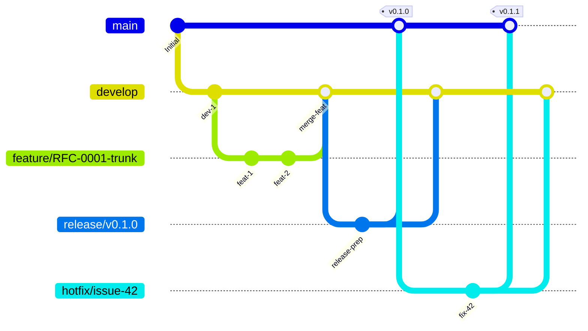

# Mycelium GitFlow

> Adapted from `aimasteracc/tree-sitter-analyzer`'s GITFLOW, tuned for a
> Rust workspace published to **crates.io**, **npm** (napi-rs), and
> **PyPI** (maturin/pyo3). The release strategy is **"registry-first"**:
> a release branch publishes the artifact to all registries *before*
> the `main` branch is updated, so we never ship a tag whose package is
> not actually available.

## Diagram



## Branches

### Permanent

| Branch | Purpose | Protection |
|---|---|---|
| `main` | Production-ready. Always deployable. Only release-plz / release branch / hotfix branch land here. | Force-push forbidden. Requires PR review + signed tag. |
| `develop` | Integration. All feature work converges here. | Force-push forbidden. Requires PR review. |

### Supporting

| Pattern | From | Merges to | Naming |
|---|---|---|---|
| `feature/*` | `develop` | `develop` | `feature/RFC-XXXX-short-desc` |
| `release/*` | `develop` | `main` **and** `develop` | `release/vX.Y.Z` |
| `hotfix/*` | `main` | `main` **and** `develop` | `hotfix/issue-XXXX-short-desc` |

## Workflow

### 1. Feature Development

```bash
git fetch origin
git checkout -b feature/RFC-0001-trunk-storage origin/develop

# ... TDD cycle: failing test → implementation → green ...

git add -p
git commit -s -m "feat(core): introduce trunk radix trie

Implements RFC-0001 §3.1.

Signed-off-by: Your Name <email@example.com>"

git push -u origin feature/RFC-0001-trunk-storage
gh pr create --base develop --fill --label "rfc:0001"
```

PRs to `develop` require:

- All CI checks green (the **Quality Gate** aggregation)
- At least **2 approving reviews**, at least 1 from a human (or BDFL override)
- All conversations resolved
- DCO sign-off on every commit
- Linked RFC reference if non-trivial

### Admin Merge Override Protocol

Admin merge may bypass a review-count gate only after Quality Gate is green.
It is a BDFL override of human review latency, not a substitute for CI,
DCO, release registry checks, or unresolved correctness concerns.

Allowed use:

- The BDFL explicitly authorizes the override in the PR, linked issue, or
  current audited chat context.
- The bypassed gate is named, for example `review-count gate`.
- `gh pr checks <number>` shows every required check as `pass`, `skipped`, or
  intentionally non-required.
- The merge method preserves DCO evidence. Prefer merge commits for admin
  overrides unless the squash body is known to retain `Signed-off-by:`.
- The operator appends a `.hive/memory/decisions.jsonl` entry recording the
  PR number, checks observed, bypassed gate, and rationale.

Forbidden use:

- Bypassing red, pending, or expired CI.
- Bypassing the release gate for `release/*` -> `main`; Charter §5.12 has
  no chat-based exception for red release CI.
- Using admin merge to hide unresolved requested changes, missing RFCs, or
  missing release/registry evidence.

### 2. Release Process (Registry-First)

> **Release-gate rule (Charter §5.12, added 2026-05-30):** a `release/*`
> branch **MUST NOT** be admin-merged to `main` unless every CI check
> on the PR is `SUCCESS` or `SKIPPED`. No exceptions — not even with
> founder authorization in chat. If CI is red, **diagnose, fix, push,
> re-run; only then merge**. `gh pr merge --admin --merge` is **not**
> a substitute for green CI on release branches. This rule was added
> after the v0.1.4 saga where red-CI admin-merges shipped broken
> Windows binaries; the founder flagged it with "CI 错误".

### Incomplete Release Incident Response

A public tag or GitHub Release is not proof that a release completed. The
release is complete only when all four ceremony steps in Charter §5.12 are
true: release branch merged to `main`, tag pushed, all five crates published
to crates.io, and release branch back-merged to `develop`.

If a tag, GitHub Release, or registry artifact exists while any ceremony step
is missing:

1. Stop release activity immediately; do not cut a new release until the
   incomplete one has an owner and issue.
2. Verify branch reachability with `git merge-base --is-ancestor vX.Y.Z
   origin/main` and `origin/develop`.
3. Verify registry state for all five `mycelium-rcig-*` crates.
4. Do not delete, retarget, or recreate public tags/releases without explicit
   founder approval; prefer a superseding patch version once automation is
   fixed if the public artifact already escaped.
5. File or update an issue with the exact missing ceremony steps and append a
   `.hive/memory/decisions.jsonl` entry.
6. Fix the automation or credential problem before any retry.


```bash
git fetch origin
git checkout -b release/v0.1.0 origin/develop

# 2a. Bump versions
#  - workspace Cargo.toml [workspace.package] version
#  - per-crate Cargo.toml if independently versioned (we are not, for now)
#  - package.json files for napi-rs bindings
#  - pyproject.toml for pyo3 bindings
cargo set-version --workspace 0.1.0
npm version --no-git-tag-version 0.1.0 --prefix bindings/node
sed -i '' 's/^version = .*/version = "0.1.0"/' bindings/python/pyproject.toml

# 2b. Refresh metadata
#  - CHANGELOG.md: move Unreleased to v0.1.0 with date
#  - README badges if applicable
#  - docs/ references
scripts/release-prep.sh 0.1.0

# 2c. Commit and push the release branch
git add -A
git commit -s -m "chore(release): v0.1.0"
git push origin release/v0.1.0

# 2d. CI on the release branch publishes to all registries
#     (crates.io → npm → PyPI). If any fails, fix on the release
#     branch and re-push. DO NOT proceed until all green.

# 2e. After all registries confirm, merge to main and back-merge develop
git checkout main
git merge --no-ff release/v0.1.0
git push origin main

git checkout develop
git merge --no-ff release/v0.1.0
git push origin develop

# 2f. Tag the main commit after both branch merges succeed
git checkout main
git pull --ff-only origin main
git tag -a v0.1.0 -m "Release v0.1.0"
git push origin v0.1.0

# 2g. Create GitHub Release with auto-generated notes
gh release create v0.1.0 \
  --title "Release v0.1.0" \
  --notes-file .release-notes.md \
  --target main

# 2h. Cleanup
git branch -d release/v0.1.0
git push origin --delete release/v0.1.0
```

### 3. Hotfix Process

```bash
git fetch origin
git checkout -b hotfix/issue-42-panic-on-empty-file origin/main

# Fix + test
git commit -s -m "fix(core): handle empty source files

Fixes #42.

Signed-off-by: Your Name <email@example.com>"

# Bump patch version, update CHANGELOG
cargo set-version --workspace 0.1.1
scripts/release-prep.sh 0.1.1

git commit -s -m "chore(release): v0.1.1"
git push origin hotfix/issue-42-panic-on-empty-file

# CI on hotfix branch publishes to registries.
# Then merge to both main and develop.
git checkout main
git merge --no-ff hotfix/issue-42-panic-on-empty-file
git tag -a v0.1.1 -m "Hotfix v0.1.1"
git push origin main --tags

git checkout develop
git merge --no-ff hotfix/issue-42-panic-on-empty-file
git push origin develop

gh release create v0.1.1 --title "Hotfix v0.1.1" --notes-file .release-notes.md --target main

git branch -d hotfix/issue-42-panic-on-empty-file
git push origin --delete hotfix/issue-42-panic-on-empty-file
```

## Commit Convention

We use [Conventional Commits](https://www.conventionalcommits.org/) v1.0,
enforced by `commitlint` in CI:

```
<type>(<scope>): <subject>

<body>

<footer (DCO sign-off, BREAKING CHANGE, refs, etc.)>
```

**Types:** `feat`, `fix`, `docs`, `style`, `refactor`, `perf`, `test`, `build`, `ci`, `chore`, `meta`.

**Scopes:** `core`, `hyphae`, `pack`, `cli`, `mcp`, `bindings`, `docs`, `hive`, `ci`, `release`, or a specific pack name like `pack/python`.

**Examples:**

```
feat(hyphae): add :called-by pseudo-class
fix(core): handle empty source files (#42)
docs(charter): clarify §5.12 escalation procedure
chore(release): v0.1.0
meta(governance): amend §5.10 review requirements
```

Breaking changes: append `!` after type/scope and include `BREAKING CHANGE:` in footer.

## CI / Automation Pipeline

Built on reusable workflows in `.github/workflows/`:

| Workflow | Trigger | Purpose |
|---|---|---|
| `ci.yml` | PR, push | Fast lane: fmt + clippy + unit. Full lane: matrix + coverage + e2e. **Single Quality Gate** is the only required check. |
| `nightly.yml` | cron 02:00 UTC | Fuzz 1h + full bench + cross-platform e2e |
| `release.yml` | push to `release/*` and `hotfix/*` | Validate → publish to crates.io → npm → PyPI |
| `hive.yml` | cron + webhook | Autonomous Hive operations (see [.hive/_orchestrator.md](.hive/_orchestrator.md)) |
| `triage.yml` | issue/PR events | Auto-label, welcome first-timers |
| `develop-automation.yml` | push to `develop` | Validate package build, optionally open release PR |

**Branch protection rules** (configured in repo settings, mirror these here for transparency):

- `main`:
  - Require pull request reviews: **2 approvals**, **1 must be human**
  - Require status checks: **`quality-gate`** (single aggregator)
  - Require signed commits
  - Require linear history (rebase or squash)
  - Restrict who can push: **release-plz bot + BDFL only**

- `develop`:
  - Require pull request reviews: **2 approvals**
  - Require status checks: **`quality-gate`**
  - Require signed commits

## Things Forbidden by GitFlow

- ❌ Force-push to `main` or `develop`
- ❌ Direct push to `main` (even by founder, except release-plz tag commit)
- ❌ Direct push to `develop`
- ❌ Merge PRs without 2 approvals (or BDFL override)
- ❌ Skip a release branch — tags must come from a `release/*` or `hotfix/*` merge
- ❌ Squash a release or hotfix branch (use `--no-ff` to preserve the merge commit)
- ❌ Land a release without **all** target registries (crates.io, npm, PyPI) successfully publishing

---

*Discipline in the river makes the delta wide.*
